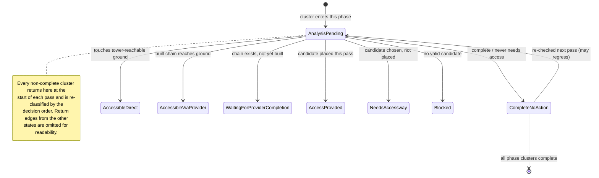

# Access Provision Framework

Status: in-progress architecture note.

This document defines the shared language for ATD access provision. The goal is to make mining designation and farmland preparation bugs diagnosable in terms of specific states and decisions, especially reports like "ramps are not being created" or "work is not being completed."

Access is not just a ramp-generation side effect. It is a prerequisite service for ATD's two main objectives:

* Mining: expose and execute the selected resource excavation work.
* Terrain preparation for construction: make the target footprint buildable, including farmland and future building-leveling workflows.

The access system should keep providing access to every origin cluster that needs it until the relevant work reaches 100.0% completion, or until ATD can explain why no valid access action exists.

## Purpose

Access provision should answer three questions consistently:

1. Which origin clusters need vehicle access before the objective can complete?
2. Of those origin clusters, which are already *Accessible* this pass (see *Accessible*) through current terrain or existing planned accessways?
3. For origin clusters that need access but do not have it, what is the best access action ATD can provide next?

The final invariant is:

> Every origin cluster that still needs vehicle access must have a route from tower-reachable ground, either through existing terrain, existing planned accessways, or newly generated accessways, until the objective is 100.0% complete.

The framework should make that answer explainable in logs, helper APIs, and code review.

## Scope

This applies to:

* Mining excavation and ramp/accessway generation.
* Farmland preparation where vehicles must reach pending terrain work.
* Construction terrain preparation where a footprint must be leveled before the building can be placed.
* Any future designation type that creates work on terrain and may need an accessway.

It does not require mining and farming to use identical generation rules. They may differ in which designations they create, which vehicle types matter, and which completion state is relevant. They should still use the same vocabulary and diagnostics.

## Glossary

**Work intent**
: The higher-level request that spawned the terrain work origins. In construction assistance this is the pending building or blueprint placement intent whose footprint requires terrain preparation before the entities can be created. A single intent may produce one or more origin clusters, and a multi-entity blueprint may produce several related intents that should not be partially released in a way that blocks vehicle access or later placement.

**Work origin** (terrain designation)
: A terrain designation at a 4x4 origin that exists because of a work intent, plus optional attributes derived from that intent. ATD usually reasons about terrain designations at origin granularity, not individual world tiles. In the simpler mining case, mining out the origin is the intent and there are usually no extra attributes. In construction assistance, the origin is derived from a pending building or blueprint placement intent, and attributes can preserve requirements from the source footprint. One defined attribute is `RequiresSoilTopLayer`, used when one or more source tiles came from a farm and the final top layer must be soil.

**Work origin attribute**
: Additional completion or handling requirements attached to a work origin because of the intent that produced it. Attributes should travel with the origin through clustering, access analysis, and completion checks. `RequiresSoilTopLayer` means the origin is not complete merely because it reaches the target height; the top layer must also satisfy the farmable soil requirement.

**Soil top-layer requirement** (attribute)
: The current conservative interpretation of `RequiresSoilTopLayer` is that the prepared origin should end with a soil top layer where farm-derived source tiles require it. Farms only require sufficiently farmable ground, so a future optimization may reduce how much soil ATD places while still satisfying the game's farmability threshold, e.g. the practical 95% soil constraint. That optimization is intentionally out of scope for the first access/provision framework; the framework should preserve the requirement as an attribute so the completion logic can be improved later without changing access clustering.

**Cluster**
: Any connected body of terrain designations or plain terrain in origin space. Clusters are allowed to merge as access providers are added: two separate origin clusters connected by the same accessway may become one larger connected cluster for pathing and graph traversal. That merge does not erase the original origin clusters or their completion requirements.

**Origin cluster**
: A connected group of work origins that came from one or more work intents and must eventually be satisfied. Origin clusters are the obligation-bearing unit of access analysis: they are what need access, become complete, wait, or block the objective. A tower area can contain multiple disconnected origin clusters, and each origin cluster must be evaluated separately even if later accessways connect them into a larger general cluster.

**Access need**
: An origin-cluster-level requirement for vehicle access, captured by the binary `Need` property (`NeedsAccessNow` or `NeverNeedsAccess`; see *Origin Cluster States*). An origin cluster needs access when it contains pending work that cannot complete without a reachable excavator, truck, or other relevant vehicle. An origin cluster that is already complete does not need new access, but it may still participate as passable terrain or as an access component for another cluster. There is no "needs access later"; sequencing is handled by deferral, not by an access need value.

**Access provider**
: A non-ground graph element that can carry vehicle access toward an origin cluster. A provider is either an **accessway** or another **origin cluster**. Ground is **not** a provider: it is the access root that providers ultimately connect back to (see *Ground*). Accessways include existing built accessways, existing planned accessways, newly generated ramps, flat cuts, bridge-like designations, or future accessway types. An origin cluster can provide access to another origin cluster when its terrain is pathable enough to connect onward and it is itself *Accessible* this pass (see *Accessible*) - directly, or through a provider chain that grounds out at tower-reachable ground. For an origin cluster waiting on provider completion, the usable amount is the corridor rule: at least `corridorWidth` consecutive designations along the relevant connector edge have access.

**Ground**
: Plain terrain that can be pathing-tested directly. Ground is the access root, not an access provider: an origin cluster is `AccessibleDirect` when it touches tower-reachable ground, and `AccessibleViaProvider` when it reaches ground through one or more providers. When a terrain designation exists at an origin, that origin should not be counted as a plain-ground pathable target. It must be evaluated through its role as an origin cluster, accessway, or other planned provider using designation target heights and provider completion state.

**Accessway**
: Any planned or existing terrain designation that is not part of an origin cluster and provides vehicle access to at least one origin cluster. Accessways may connect tower-reachable ground to an origin cluster, connect one origin cluster to another, or connect through other access providers. In player-facing terms this may look like a ramp, a flat cut, or a bridge-like flat designation out of terrain. An accessway is one kind of access provider.

**Ramp**
: A sloped accessway. In code this may refer to a specific terrain designation proto. In design discussions, avoid using "ramp" as shorthand for all accessways unless slope is specifically relevant. As an accessway, a ramp obeys the shared `corridorWidth` clearance rule; it has no width parameter of its own.

**Bridge**
: A flat accessway over terrain, out of terrain, or through terrain. This includes small flat connector designations, such as a one-tile link between nearby farm-preparation origin clusters. A bridge can provide access just as a ramp can, but should be evaluated with flat target heights.

**Access mouth**
: The edge where an accessway connects to an upstream provider: tower-reachable ground, another reachable accessway component, or an already-provided origin cluster.

**(Cluster) attachment edge**
: The edge where an origin cluster connects to plain reachable ground or to an accessway. This edge must be **slope-traversable** (height delta `<= 0.5` tiles per step, see *Edge-compatible*); a flat attachment (delta `< 0.1` tiles) is the special level-to-level case.

**Tower-reachable ground**
: Current terrain that is pathable from the tower on the present terrain. It is a **single** set for the whole pass, independent of which cluster is being evaluated: tiles carrying an unfinished terrain designation are excluded for everyone (see *Ground*), so no cluster's accessibility ever depends on its own future completion.

**Vehicle / required vehicle type**
: The land vehicle whose work a cluster is waiting on. ATD organizes vehicles primarily by **size tier**, because tier is what drives corridor width (see *Corridor width*); the slope rule is identical across tiers (vehicle-generic, `<= 0.5` per step). Two tiers matter:

  * **Regular tier** - standard excavators, trucks, and dumpers. Narrower clearance.
  * **Mega tier** - mega excavator, mega dumper, and other oversized variants. Same climb ability, but wider clearance, so they set a larger Auto corridor width when assigned.

  Tier governs *width only*. The **type of work** present in a cluster - not the designation proto - governs which vehicles are *required* and whether they must be assigned to the tower:

  | Work type | Required vehicle role | Tower assignment |
  |---|---|---|
  | Excavation (mining or cutting terrain down) | excavator to dig **and** a hauler (truck/dumper) to carry the spoil away | required - both must be assigned to the tower |
  | Dumping (filling terrain up) | hauler (truck/dumper) only | not required - dumping designations attract global vehicles |

  Mining, farmland preparation, and construction leveling are not vehicle categories of their own; each is some mix of excavation and dumping, so the requirement follows the work actually pending in the cluster, not the proto. A leveling designation that contains only dumping work needs only haulers and no excavation team, even though the same proto can host excavation work elsewhere. Harvesters and planters are forestry vehicles (handled by AFD) and are **not** part of ATD terrain access. The required vehicle type for a cluster is whichever role its *pending* work needs; the required width is the widest tier among the vehicles that must traverse the corridor. `NoSlopeAllowed` units (rocket transporter) and ships are **out of scope** for ATD access - they are not land terrain workers.

**Accessible** (current pass)
: The single grounded-reachability predicate the rest of the framework refers to; "has access", "sufficient access", and "reachable" all resolve to this. An element (origin cluster, accessway, or other provider) is *Accessible* on a pass iff a forward flood that starts at tower-reachable ground and expands outward reaches it:

  * **Base.** Tower-reachable ground is Accessible. Ground tiles that carry an unfinished terrain designation are **not** plain pathable ground and are excluded from the base; they are reached only through their provider role (see *Ground*).
  * **Step.** An element is Accessible if it shares a slope-traversable edge (`<= 0.5` per step) with an already-Accessible element across at least `corridorWidth` of clearance, and that upstream element is either built-and-reachable or `WaitingForProviderCompletion` with at least `corridorWidth` consecutive workable designations along the shared edge.

  Because the flood only ever adds elements reached from a grounded source, no element can derive accessibility from a chain that passes through itself: the provider graph is **acyclic by construction** and needs no separate cycle check. `AccessibleDirect` is the base-case form (touches ground directly); `AccessibleViaProvider` is the step-case form (reached through one or more providers).

**Access graph**
: A graph containing tower-reachable ground, relevant existing/planned accessways, and candidate accessways. Its edges are only valid when neighboring terrain/designation heights are compatible for vehicle movement.

**Edge-compatible, Edge-connected**
: Two neighboring tiles/origins can be traversed by vehicles across their shared edge. This is governed by the game's real rule, verified in `Mafi.Core.PathFinding/ClearancePathabilityProvider.getEncodedSteepness`: per-step steepness is the absolute height delta to a neighbor, bucketed against two global constants, `FLAT_STEEPNESS_DELTA = 0.1` tiles and `MAX_STEEPNESS_DELTA = 0.5` tiles. Every land vehicle (truck, dumper, excavator) uses `SteepnessPathability.SlightSlopeAllowed`, so the practical rule is two relations:

  * **Slope-traverse** (general movement, ramps): the edge is traversable when the height delta is `<= 0.5` tiles per step. A full 1-tile climb is therefore *not* a single-step edge; it needs at least two horizontal tiles of ramp (`<= 0.5` per step). This is the relation to use for ramps and for any vehicle-movement reachability question.
  * **Flat-connect** (level-to-level joins, flat connectors/bridges, attachment to flat ground): the edge is at the same level when the height delta is `< 0.1` tiles. Use this where ATD specifically needs a flat join rather than a slope.

  Slope ability is **vehicle-generic** here: the 0.5-tile cap is the same for all normal land vehicles and is not a per-proto climb angle. (`NoSlopeAllowed` vehicles such as the rocket transporter, and ships, are out of scope for ATD access.) For plain ground these deltas use current terrain heights; for designations they use target heights where available. In short hand, an edge that satisfies the slope-traverse relation is simply *connected*.

**Origin cluster accessible**
: Shorthand for an origin cluster being *Accessible* this pass (see *Accessible*): a forward flood from tower-reachable ground reaches it, directly or through accessways and/or already-Accessible origin clusters. This corresponds to the `Accessibility` property being `AccessibleDirect` or `AccessibleViaProvider` (see *Origin Cluster States*).

**Origin cluster as provider**
: An origin cluster that is still `WaitingForProviderCompletion` may still act as an access provider for another origin cluster once at least `corridorWidth` consecutive designations along the relevant edge have access. This prevents ATD from requiring full completion of a large cluster before using an accessible corridor through it, while still avoiding false-positive access through designations that are complete but no longer reachable.

**Origin cluster provided (with access)**
: An origin cluster has been given a classified `AccessClusterState` for this pass - one of `AccessibleDirect`, `AccessibleViaProvider`, `AccessProvided`, `WaitingForProviderCompletion`, or `CompleteNoAction` (see *Origin Cluster States*). Provision is stronger than "we attempted ramp generation"; it means the origin cluster has a classified next state rather than an undecided one.

**Vehicle-workable**
: A pending origin, origin cluster, accessway, or other access provider can be reached by the required vehicle type and is in a state that the vehicle can actually work. This is stronger than "there is some path nearby." Pathing must account for the required **corridor width** (see *Corridor width*) - wider vehicles need wider clearance - while climb slope ability is treated as vehicle-generic. For accessways, vehicle-workable means the provider can actually be built or cleared by the relevant vehicle, so it can move the provider chain toward the origin cluster instead of merely existing as an unreachable planned designation.

**Corridor width** (`corridorWidth`)
: The effective clearance, measured in origin tiles (4x4 units), that an accessway or provider edge must offer for vehicles to move through it. Because ramps, flat cuts, bridges, and corridors are all **accessways**, they obey this single clearance rule - there is no separate ramp-width parameter. The **same value** also serves the "complete enough" threshold in *Origin cluster as provider* (how many consecutive workable designations along an edge let a still-incomplete cluster act as a provider).

  The effective width comes from the world-level **`accessWayClearance`** setting (see below). When that setting is **Auto**, ATD derives the clearance from the game rather than using a fixed number:

  * Use the widest clearance required by any vehicle assigned to the tower, including soft-released vehicles.
  * If no vehicles are assigned to the tower, use the widest clearance required by any truck or excavator in the global vehicle pool.
  * If the global pool has no such vehicles (unlikely - for example a vehicleless experiment involving other mods), use `0`.

  Corridor width covers only horizontal clearance; slope/climb ability is a separate, vehicle-generic concern (see *Edge-compatible*).

**Accessway clearance setting** (`accessWayClearance`)
: The single, **world-level** player setting that controls `corridorWidth` for every accessway in the world (ramps, corridors, flat cuts, bridges alike). Range is `[Auto, 0-2]`, with **`-1` as the sentinel for Auto** and Auto as the default. The live value is persisted in the **vanilla save** (the published game setting / state blob); `config.json` only supplies the **new-game default** used when a world is first created. Auto derives clearance from the required vehicles as described under *Corridor width*; an explicit `0`, `1`, or `2` overrides that derivation for the whole world. Because Auto handles essentially every real case (an estimated 99% of use), this is a world-level setting rather than a per-tower one, which keeps the tower inspector simple. The previous per-tower clearance/ramp-width controls are **superseded**: their old saved values are intentionally ignored and not migrated, since Auto reproduces the intended behavior without them.

**Waiting for provider completion**
: An origin cluster has a valid, complete provider chain (planned or partially built) that is not yet usable because one or more providers still need vehicle work. This is the `WaitingForProviderCompletion` state; see *Origin Cluster States* for how it is reached and exited.

**Work complete**
: A single work origin is *complete* when it satisfies **all** of its requirements, not merely target height: the terrain matches the intended target state **and** every work-origin attribute (for example `RequiresSoilTopLayer`) is satisfied. This is separate from whether ATD has finished a generation pass or whether vehicles can reach remaining work. See *Completion* for how per-origin completeness rolls up to clusters and phases.

**Session complete**
: ATD's current operation has no more provision or terrain work to perform. A session should not be marked complete merely because access provision failed or was skipped. A major phase only completes - and the session only advances to the next phase or to normal operation - when every origin cluster in the phase is `CompleteNoAction` on the same pass (see *Phase Gating*), because each phase uses different tower/area-level dumping rules and must not overlap.

**Blocked**
: ATD found work that still needs access or execution but cannot find a valid next action. The canonical representation is the `Blocked` state plus a `BlockedReason` (see *Origin Cluster States*). All reasons produce a user-facing warning notification; they differ only in the explanation shown (no valid accessway candidate, unreachable access mouth, incompatible heights, blocked terrain/buildings, or unsupported geometry).

**Waiting**
: A session-level condition: ATD found a valid plan but every remaining cluster is either complete or `WaitingForProviderCompletion`, so no new action can be taken until already-created designations are built. This is the session view of one or more clusters being in the `WaitingForProviderCompletion` state, not a separate cluster state.

## Core Invariants

1. Do not skip access provision because "an accessway exists" somewhere in the tower area. Skip only when every origin cluster that needs access has tower-reachable access, an already-planned provider that can become reachable, or no remaining access need.
2. Evaluate disconnected origin clusters independently. One accessible origin cluster does not prove another origin cluster is accessible, even if both later become part of a larger connected cluster through accessways. Independence is preserved automatically by the single fixpoint flood (see *Accessible*): a cluster is only ever marked accessible if the flood reaches it from ground, so an unrelated accessible cluster cannot vouch for it. (This independence is about *evaluating* reachability; *generating* new providers is order-dependent and runs closest-to-tower first - see Provision Pipeline step 8.)
3. Distinguish current terrain pathability from future designation target geometry.
4. Use target heights for planned designations and current terrain heights for plain terrain when checking edge compatibility.
5. A generated access provider must connect both ends: one side to tower-reachable ground or a reachable upstream provider, the other side to the origin cluster or a provider that will make the origin cluster reachable.
6. "Complete" and "reachable" are separate states. A completed terrain origin may still be relevant to access, and an unreachable origin should not make the session look successfully complete.
7. Access provision is iterative. An origin cluster can move from `NeedsAccessway` to `AccessProvided`, then to `WaitingForProviderCompletion`, then to `AccessibleViaProvider` and finally `CompleteNoAction`; the operation is not done until all origin clusters are complete or explained. No state is permanently terminal: every state, including `CompleteNoAction` and `Blocked`, is recomputed each pass, so a `CompleteNoAction` cluster can regress if its terrain is later disturbed. A phase advances only when **all** of its origin clusters are `CompleteNoAction` on the same pass (see *Phase Gating*).
8. Logs should name the origin cluster, access phase, selected provider, completion percentage, and reason for the decision.

## Provision Pipeline

The access framework can be described as these phases:

1. **Collect work origins**
   Gather origins that still matter to the objective, grouped by the work intent that created them when applicable. This includes pending work origins, incomplete provider origins, and completed origins that may serve as passable connectors.

2. **Build origin clusters**
   Split objective work origins into connected origin clusters. This prevents one valid accessway from hiding a separate inaccessible area.

3. **Select the in-scope working set (submission filter)**
   Before classifying needs, decide which clusters/subclusters are submitted to access analysis *this pass*. Two inputs drive the filter:

   * **Current phase.** The active major phase admits only the origins it owns (for example, farmland preparation submits farm origins and holds non-farm origins back). The exact phase ordering for farmland preparation is defined in the [Farmland Preparation Sub-Process](farmland-preparation-subprocess.md); treat it as the worked example of phase gating.
   * **Upstream dependency readiness.** A subcluster that depends on another cluster being workable is withheld until that dependency is ready.

   Clusters not in scope are simply **not submitted** this pass; they carry no access state until a later pass admits them (this is the "deferral" the state model relies on, made explicit). Deferral is a sequencing concern here, never a `Need` value.

4. **Classify origin cluster access needs**
   For the in-scope working set, decide whether each origin cluster needs vehicle access now or not at all (`Need = NeedsAccessNow` or `NeverNeedsAccess`). This is where completion, phase, vehicle type, and vanilla workability gates are applied. There is no "later" value: out-of-scope subclusters were already filtered out in the previous step rather than classified here.

5. **Build tower-reachable ground**
   Build the **single** ground set: current terrain that vehicles can reach from the tower. Tiles carrying an active terrain designation are **not** plain ground and are excluded for every cluster (see *Ground* and *Accessible*); they are reached only through their provider role. There is no per-cluster ground recomputation - because a cluster's own unfinished designations are never in the ground set, no cluster can bootstrap its own access through itself.

6. **Build existing access providers**
   Find relevant plain terrain, built accessways, planned accessways, completed work terrain, and other origin clusters that can serve as providers. No self-dependency check is needed: the flood in the next step only ever adds elements reached from ground, so the provider graph is acyclic by construction (see *Accessible*).

7. **Evaluate existing access (single fixpoint flood)**
   Compute accessibility as **one forward reachability fixpoint per pass**, starting at tower-reachable ground and expanding outward across slope-traversable, corridor-wide edges to every provider and in-scope origin cluster it can reach. Repeat until no new element becomes reachable. This *evaluation* step is order-independent: it only reads existing terrain and existing/planned providers, so it does not matter which cluster is examined first, and a provider that became reachable earlier in the same flood is immediately usable by clusters downstream of it. Each in-scope cluster the flood reaches is `AccessibleDirect` (touches ground) or `AccessibleViaProvider` (reached through providers); clusters the flood does not reach are `NotAccessible`.

8. **Generate missing providers (closest-first, interleaved with re-flood)**
   For clusters still `NotAccessible`, ATD *creates* new providers, and unlike evaluation this **generation step is order-dependent**: each provider it places changes the graph for the clusters processed after it. Process the not-yet-accessible clusters in **ascending distance from tower-reachable ground - closest first**. For the current cluster, **route** candidate accessways (see *Accessway Routing*) and rank them by the lexicographic criteria in *Candidate Selection*; the best action may be a ramp, flat cut, bridge-like accessway, waiting for a partially built provider chain, or reporting the cluster as blocked. After placing a provider, **fold it into the access set and re-flood** (extend the step 7 flood) before moving to the next cluster, so a farther cluster can branch off the freshly placed provider instead of digging its own duplicate ramp back to the tower. This yields a natural trunk-and-branch topology: the nearest cluster anchors a ramp close to the tower, and others connect onto it. Closest-first is a deliberate greedy heuristic - predictable and cheap, not provably optimal.

9. **Provide access**
   Create the selected provider chain when ATD can act immediately. A link is valid only if it is edge-compatible by definition. If the chain cannot be formed, search for a different solution such as a separate accessway to ground. If the selected provider chain already exists but is not yet built, classify the origin cluster as `WaitingForProviderCompletion` instead of generating duplicates.

10. **Re-evaluate until complete**
    On later ticks/passes, re-run the same analysis from step 1, including the submission filter so deferred subclusters can re-enter scope. Access provision succeeds only when all origin clusters that need access have it and the objective work reaches 100.0% completion.

## Origin Cluster States

Per-cluster access status is a **single flat enum**, `AccessClusterState`, computed each pass from two upstream input properties. The properties are not themselves states; they are inputs to the decision.

**`Need`** (does the cluster need vehicle access at all?)

* `NeedsAccessNow` - contains incomplete, vehicle-dependent work.
* `NeverNeedsAccess` - work is complete, or it needs no vehicle, so there is nothing to provide.

There is deliberately **no "needs access later"** value. Sequencing is handled by deferral, not by a state: a subcluster that must wait its turn (for example non-farm origins held back during farmland preparation) is simply not submitted to access analysis this pass, so it has no access state until it re-enters the loop. A cross-cluster dependency where one cluster must be worked before another becomes reachable is not "later" either; it is `WaitingForProviderCompletion` through the origin-cluster-as-provider rule.

**`Accessibility`** (does it currently reach tower-reachable ground?)

* `AccessibleDirect` - touches tower-reachable ground across a slope-traversable border.
* `AccessibleViaProvider` - reaches ground through a built, reachable provider chain.
* `NotAccessible` - no usable route right now.

**`AccessClusterState`** (the value logged and returned per cluster per pass):

| State | Meaning | Phase-complete? |
|---|---|---|
| `CompleteNoAction` | target terrain already complete, or cluster never needs access | yes |
| `AccessibleDirect` | accessible directly from ground; work can proceed | no |
| `AccessibleViaProvider` | accessible through a built provider chain; work can proceed | no |
| `NeedsAccessway` | needs access now, not accessible, a candidate provider is chosen but not yet placed | no |
| `AccessProvided` | ATD placed the selected provider designations this pass | no |
| `WaitingForProviderCompletion` | a full provider chain exists but is not yet built or workable | no |
| `Blocked` | needs access now but no valid next action exists; carries a `BlockedReason` | no |

No state is permanently terminal. `CompleteNoAction` is the only state that counts as *phase-complete*, but it is still recomputed every pass: a regression (terrain re-raised, a provider corridor built over, a cluster split by new work) can move a cluster out of `CompleteNoAction` back into a needs/waiting state. "Phase-complete" is therefore a property of the current pass, not a sink the cluster can never leave.

**`BlockedReason`** (attached to `Blocked`). All reasons produce the same effect - a player warning notification - and differ only in the explanation shown:

* `NoCandidate` - no candidate accessway could be found.
* `MouthUnreachable` - a candidate exists, but its upstream mouth cannot reach tower-reachable ground through a valid provider chain.
* `EdgeMismatch` - a candidate exists, but the cluster attachment edge is not slope-traversable.
* `Obstructed` - terrain, buildings, or other entities block the only viable accessway.
* `UnsupportedGeometry` - the required accessway shape is not supported.

### Decision Order

Conceptually every cluster begins each pass in an unclassified `AnalysisPending` entry and is assigned exactly one `AccessClusterState` by the first matching rule below. `AnalysisPending` is a per-pass entry point, not a stored or logged classification - by the time a cluster is reported it always holds a concrete state.

First match wins, recomputed every pass:

1. work complete -> `CompleteNoAction`
2. `Need = NeverNeedsAccess` -> `CompleteNoAction`
3. `Accessibility = AccessibleDirect` -> `AccessibleDirect`
4. `Accessibility = AccessibleViaProvider` (chain built and reachable) -> `AccessibleViaProvider`
5. an existing provider chain is present but not fully built -> `WaitingForProviderCompletion`
6. `Need = NeedsAccessNow`, `NotAccessible`, no existing chain -> choose the best candidate provider:
   * placed this pass -> `AccessProvided`
   * candidate identified, not yet placed -> `NeedsAccessway`
   * no viable candidate -> `Blocked` (with `BlockedReason`)

Because the decision order re-runs every pass, clusters recover (and regress) on their own: a `Blocked` cluster becomes `NeedsAccessway` or `AccessProvided` as soon as a candidate turns viable, and a disturbed `CompleteNoAction` cluster is simply reclassified next pass. See the state table above for which state is phase-complete, and *Phase Gating* for why only `CompleteNoAction` ends a phase.

### Phase Gating

`CompleteNoAction` gates phase advancement, not per-cluster termination. ATD's major phases (for example farmland preparation -> farmland filling -> general construction leveling -> normal) each apply different tower/area-level dumping rules, so they must not overlap. The session may only terminate the current phase and enter the next when **every** origin cluster in that phase is `CompleteNoAction` on the same pass. If even one cluster has regressed out of `CompleteNoAction`, the phase stays open and is reworked before the next phase begins. The farmland preparation -> filling pair is the worked example of this rule; see the [Farmland Preparation Sub-Process](farmland-preparation-subprocess.md).

### Lifecycle



Notes:

* `AnalysisPending` is the single entry point each pass. A cluster does not "start" at a particular classified state; it is re-derived from the decision order every pass and can land anywhere - most commonly `AccessibleDirect`, `NeedsAccessway`, or `WaitingForProviderCompletion` on first entry.
* The forward progression a healthy cluster usually follows across passes is `NeedsAccessway` -> `AccessProvided` -> `WaitingForProviderCompletion` -> `AccessibleViaProvider` -> `CompleteNoAction`, but every step is just the decision order re-running, not a stored transition.
* `AccessProvided` is a one-pass marker; on the next pass the same cluster re-enters `AnalysisPending` and typically reads as `WaitingForProviderCompletion` until its chain is built.
* `CompleteNoAction` is not a sink. It returns to `AnalysisPending` each pass; if its target terrain has been disturbed (for example dumped material) it is reclassified normally - landing back in `AccessibleDirect` when it still touches ground elsewhere, or in a needs/waiting state when access was also lost. The `--> [*]` edge represents the phase ending, which only happens once **all** clusters in the phase are simultaneously `CompleteNoAction` (see *Phase Gating*).
* All regressions (provider destroyed, terrain raised, building placed in the corridor, material dumped on finished terrain) are handled the same way: the cluster passes through `AnalysisPending` and is re-classified. They are not drawn as explicit per-state edges.

## Completion

Completion is measured **per origin as a boolean, rolled up by count**. There is no volume or progress-bar metric in the framework.

* **Origin.** A work origin is either complete or not (see *Work complete*): it must reach its target height **and** satisfy every work-origin attribute. An origin that reached target height but still owes a soil top layer (`RequiresSoilTopLayer`) is **not** complete.
* **Cluster / session percentage.** `completion% = complete origins / total in-scope origins`, reported to one decimal place (for example `71.4%`). This is the `complete=` / `completion=` value in the diagnostic log.
* **Display only.** The percentage exists for human diagnosis of "work is not being completed" reports. It is never used as a control signal, and rounding never decides behavior.
* **The gate is an exact boolean.** Phase advancement and the "100.0% complete" invariant key off the exact predicate *every in-scope origin is complete* (equivalently, every cluster is `CompleteNoAction` on the same pass; see *Phase Gating*) - not the displayed percentage. A pass that rounds to `100.0%` while one origin is still incomplete does **not** advance the phase.

## Accessway Routing

Candidate Selection ranks accessways but does not invent their geometry. **Routing** is the step that turns "this cluster needs a provider, from somewhere over there" into concrete candidate accessways - the sequence of designation tiles a vehicle would actually drive. It runs inside Provision Pipeline step 8, once per not-yet-accessible cluster, and hands its output to Candidate Selection. Routing produces *shape*; the fixpoint flood confirms *grounding*; selection picks the *winner*.

The routing engine described below is the current straight-corridor enumerator. A planned alternative replaces it with a least-work corridor search over the heightfield (turning and switchbacks fall out for free, and the path cost subsumes selection); see [accessway-pathfinding.md](../planned/accessway-pathfinding.md). Both are intended to live behind the same `AccessCandidate` contract and be A/B compared.

### What a routed candidate is

A candidate accessway is a **corridor**: a band `corridorWidth` lanes wide (see *Corridor width*) made of one or more parallel lanes of designation tiles. Each candidate has:

* an **attachment edge** - the cluster border tiles the corridor grows out of (must end up slope-traversable, see *Edge-compatible*);
* a **direction** - one of the four cardinal directions the corridor runs along;
* a **mouth** - the outer end that must reach an upstream provider (tower-reachable ground or an already-reachable accessway/cluster);
* a per-lane **attachment depth** and target heights for every cell, so the whole band shares one consistent grade even when the cluster edge is uneven.

### Two routed families

Routing emits two shapes, matching the *Accessway* / *Ramp* / *Bridge* vocabulary:

* **Sloped corridor (ramp).** Grown outward from the attachment edge, each successive cell steps one depth increment shallower than the last, sized so every internal edge stays slope-traversable (`<= 0.5` per step; a full level change needs at least two cells, see *Edge-compatible*). The corridor ends where it surfaces to existing terrain. Per-lane attachment depth lets an uneven edge still yield a single coherent grade across the band.
* **Flat connector (bridge).** A depth-flat one-step join at the cluster perimeter - the level-to-level family used to link a cluster to adjacent reachable ground or to a neighbouring cluster across a `< 0.1`-tile seam.

### How candidates are enumerated

Routing is a **local, exhaustive enumeration**, not a long-range path search. For each perimeter origin of the cluster (interior origins are skipped - they cannot produce a shorter valid exit), for each of the four cardinal directions, and for each lateral lane offset that keeps the band `corridorWidth` wide, ATD attempts to grow one straight corridor of that family. An attempt is discarded the moment any cell is obstructed by terrain, a building, another entity, or a tile already reserved by an accessway placed earlier this pass. When the preferred corridor is blocked, a **lateral retry** shifts the band sideways and tries again before giving up on that edge/direction.

Each surviving corridor is a candidate only if its mouth actually reaches an upstream provider. That is **not** re-derived inside routing: routing emits the geometry, and the same step-7 reachability flood (a capped BFS from the mouth) decides whether the mouth grounds out. A corridor whose mouth never reaches a provider is dropped before selection; if a cluster has no surviving candidate it is `Blocked` with `NoCandidate` (or `MouthUnreachable` when geometry existed but never grounded).

The full surviving set is then handed to *Candidate Selection*, which ranks it by Valid -> Useless material moved -> Mouth distance.

### Current limitations

Routing today emits **straight, single-segment** corridors only. It does not:

* **turn or switchback** - there is no L-shaped or zig-zag ramp, so a cluster that can only be reached by a bend is routed as separate segments across passes (closest-first re-flooding lets one straight segment attach onto a previously placed one) rather than as a single planned dog-leg;
* **route a multi-bend chain in one pass** - chaining is an emergent product of closest-first generation, not a path ATD plans end-to-end;
* **prefer simpler geometry** - a saddle and a long ramp compete purely on the cost criteria in *Candidate Selection*.

Turning/switchback routing is a known follow-up (the roadmap's "make ramps turn?" item). The planned least-work corridor search in [accessway-pathfinding.md](../planned/accessway-pathfinding.md) removes all three limitations at once - turns, dog-legs, and cheaper-geometry preference are inherent to a path search. Construction Assist deliberately relies on this section: it states the work type and lets the framework route the accessway, rather than picking a ramp shape itself.

## Candidate Selection

When a cluster reaches decision-order rule 6 (`Need = NeedsAccessNow`, `NotAccessible`, no existing chain), ATD must choose the **best** candidate access action from the set that *Accessway Routing* produced. "Best" is defined as a **lexicographic comparison over named criteria**, not a single opaque number. Earlier criteria dominate later ones; later criteria only break ties. This keeps the choice diagnosable: a report like "it built a silly ramp" can be traced to the criterion that decided it.

Criteria, in priority order:

1. **Valid** (hard filter, not a score). A candidate is eligible only if it is slope-traversable (`<= 0.5` per step), fits the required corridor width, connects to a real provider chain, and is not obstructed by terrain, buildings, or other entities. Ineligible candidates are discarded before scoring; if none remain the cluster is `Blocked` with the appropriate `BlockedReason`.
2. **Useless material moved.** Prefer the candidate that moves the least useless terrain volume (dig + fill) to build the accessway. For digging, any excavated volume of useful products is discounted.
3. **Mouth distance.** Prefer the shorter distance from the candidate's mouth to the upstream provider edge it attaches to (the next provider toward the tower, or tower-reachable ground directly). Shorter connections are cheaper and less fragile.

Geometry simplicity is deliberately **not** a ranking criterion: a compact saddle and a long straight ramp compete purely on the cost criteria above, so ATD may pick a saddle when it genuinely moves less material or covers less distance.

These criteria rank candidates *for a single cluster*. The **order in which clusters are processed** is separate and matters because each placed provider becomes a candidate target for later clusters: clusters are generated **closest-to-tower first**, re-flooding after each placement (see Provision Pipeline step 8). The two interact constructively - once the near cluster's ramp exists, the *Mouth distance* and *Useless material moved* criteria naturally make "connect to that ramp" the winning candidate for farther clusters.

The authoritative, diagnosable output is the **dominant criterion** that decided the choice, logged as `decidedBy=<criterion>`. There is no opaque numeric score in the log.

## Diagnostic Log Shape

Access logs should be compact but structured enough to compare reports:

```text
[ATD Access] mode=construction-prep tower=(x,z) intents=2 workOrigins=34 originClusters=3 connectedClusters=2 complete=62.5%
[ATD Access] originCluster=1 origins=18 need=now state=AccessibleViaProvider provider=planned-ramp accessOrigin=(120,88) mouth=(116,88)
[ATD Access] originCluster=2 origins=9 need=now state=NeedsAccessway reason=no edge-compatible provider chain to tower-reachable ground
[ATD Access] originCluster=2 state=AccessProvided provider=generated-ramp proto=TerrainRamp origin=(128,92) direction=West decidedBy=material-moved
[ATD Access] originCluster=3 origins=7 need=now state=Blocked reason=NoCandidate detail=no candidate reached target heights 4..6
[ATD Access] warning tower=(x,z) originCluster=3 reason=no valid accessway candidate; work cannot progress
```

For "work not being completed" reports, include both completion and workability:

```text
[ATD Access] originCluster=2 complete=false completion=71.4% vehicleWorkable=false providerWorkable=true state=WaitingForProviderCompletion provider=planned-ramp
```

## Implementation Map

Current files involved:

* `src/Access/AccessModels.cs` - shared access states, needs, intents, origins, clusters, providers, candidates, and results.
* `src/Access/AccessReachability.cs` - grounded fixpoint reachability over origin clusters and providers.
* `src/Access/AccessDiagnostics.cs` - shared cluster/provider decision logging.
* `src/Access/AccessSearchModels.cs` - immutable V1/G search state, profiles, snapshot, durability inputs, and result trace.
* `src/Access/AccessPathSearch.cs` - deterministic Dijkstra/A* dry-run engine and transition fixtures.
* `src/Access/AccessDesignationPlan.cs` - read-only generated-designation plan model.
* `src/Access/AccessPathMaterializer.cs` - whole-path replay, materialization, and final plan validation without world mutation.
* `src/ATD.ExperimentalAccessPathfinding.cs` - gated CoI-world snapshot builder and per-cluster dry-run adapter.
* `src/ATD.RampGeneration.cs` - mining access generation and duplicate-access checks.
* `src/ATD.Scan.cs` - mining designation scan and execution flow.
* `src/ATD.FarmingAccess.cs` - farmland access and reachability helpers.
* `src/ATD.FarmingPreparationSession.cs` - farmland preparation session state and completion behavior.
* `src/ATD.Settings.cs`, `src/ATD.ModSettingsTab.cs` - Phase 3 public feature/search settings and persistence surface.

Current helper family to refine:

* `ExistingPlannedAccessProvidesAccessToAllClusters`
* `BuildDesignationOriginClusters`
* `ClusterHasTowerReachableAccess`
* `TryClusterEdgeConnectsToAccess`
* `ExistingAccessOriginConnectsToTower`
* `IsExistingAccessDesignation`

The shared model and reachability core now exist, but these mining-local helpers remain migration points. Move them only behind regression fixtures; the long-term shape is a small shared access-analysis/search library rather than mining-only helpers that farming duplicates in parallel.

## Suggested Helper Model

Introduce a small internal vocabulary in code:

* `AccessWorkIntent` - source request that owns related work origins, such as a mining scan, farm placement, building placement, or blueprint placement batch.
* `AccessWorkOrigin` - terrain designation origin plus source intent, optional attributes, and target/current height context.
* `AccessOriginCluster` - obligation-bearing cluster id, origins, source intents, bounds, and target height/attribute summary.
* `AccessOriginSubcluster` - attribute or phase partition inside an origin cluster, used when some origins need separate sequencing such as farm-derived origins that must be prepared and filled before adjacent non-farm origins.
* `AccessConnectedCluster` - general connected body of origins/providers used for pathing and graph traversal.
* `AccessNeed` - whether the origin cluster needs access now or never, including required vehicle/workability context. There is no "later"; deferral is handled by not submitting a subcluster this pass.
* `AccessProvider` - an accessway or origin-cluster graph element plus whether its provider chain reaches the tower. Ground is not a provider; it is the access root the chain terminates at. Accessways may be existing, planned, generated, or candidate designations. Origin clusters may provide access when their terrain is pathable enough to connect onward.
* `AccessEdge` - shared edge between two origins with compatibility result.
* `AccessCandidate` - a possible provider ATD can create, with mouth, attachment, work-volume, material value, and duplicate-avoidance data.
* `AccessAnalysisResult` - origin cluster state, need, selected provider/candidate, reason, and completion/workability summary.

This does not need to become a large public abstraction. The value is in making mining and farming call the same diagnostic and reachability concepts.

**Code home.** The shared model and analysis logic live in a dedicated **`Access/` subfolder with its own namespace**, treated as an internal access helper library: the model types above, the fixpoint reachability flood, the closest-first generation pass, and candidate selection all belong here. Player-facing applications stay in **root-level files** as today - UI/tower-inspector integration, Harmony patches, the mining scan and farming session entry points, and notification rendering call *into* the `Access/` library rather than embedding its logic. This keeps the access core mode-agnostic and prevents mining (`ATD.RampGeneration.cs`, `ATD.Scan.cs`) and farming (`ATD.FarmingAccess.cs`) from each re-implementing reachability.

## Phased Implementation Plan

This plan continues the phase numbering already used by the implementation commits. Each phase must leave the current straight-corridor generator usable as the control path. The experimental pathfinder remains off by default behind the public `Turning ramps (experimental)` setting; disabling that setting must reproduce current access generation without constructing search state or changing candidate selection.

### Phase 1 - Framework foundation and grounded reachability (complete)

Implemented by `2e67b37`:

* Added the shared `Access/` model, diagnostics vocabulary, origin-cluster states, blocked reasons, needs, providers, candidates, and analysis results.
* Added the forward grounded-reachability flood used to classify direct and provider-mediated access.
* Began routing mining access decisions through the shared model without replacing the current ramp geometry generator.

**Exit evidence:** mining access compiles and runs through shared cluster/result types; grounded reachability is no longer inferred from a single local boolean.

### Phase 2 - Iterative provider generation and candidate selection (complete)

Implemented by `9b71921` and baseline-adjusted by `7255cbb`:

* Processes inaccessible clusters closest to tower-reachable ground first.
* Places one provider, folds it into the provider set, and re-runs the reachability flood before handling farther clusters.
* Ranks eligible straight-generator candidates lexicographically by `Valid -> Useless material moved -> Mouth distance`.
* Treats mouth/provider reachability as part of candidate validity and keeps deterministic ordering for exact score ties.

**Exit evidence:** the straight generator remains the production baseline; disconnected clusters are evaluated independently; selected candidates produce a real grounded provider chain.

### Phase 3 - Freeze shared search inputs and feature gates (implemented; in-save validation pending)

Build the mode-independent inputs needed by both the current generator and the experimental V1 search:

* Add the public `Turning ramps (experimental)` setting, default off, with the V1-only tooltip defined in [Accessway Pathfinding](../planned/accessway-pathfinding.md#public-feature-gate).
* Add a public search-algorithm sub setting with Dijkstra as the default and A* available but initially opt-in.
* Add public parameter `workDistanceScale`, default `1`, through the existing Mod Settings / `ATDsettings.json` path without introducing mod-owned save state.
* Add public parameter `accessLandslideRunPerHeight`, default `1` (45 degrees), range `0.05..2`, so the symmetric landslide hourglass can be widened or narrowed without invalidating directional durability pruning.
* Snapshot all search inputs once per provision pass: tower bounds, active vanilla designations, current terrain heights, target corner profiles, building occupancy, durability exclusions, tower-reachable G flood, origin clusters, and existing providers.
* Keep the snapshot immutable for one cluster search. Stored/temporarily hidden designations and speculative search output are not part of it.
* Extract shared edge-profile, corner-height, and active-designation queries from mining-only helpers into `Access/` without changing straight-generator output.

**Exit gate:** with `Turning ramps (experimental) = off`, snapshot creation and new search code are not invoked and representative saves produce the same selected straight candidates as the Phase 2 baseline.

**Implementation status:** the four public settings, immutable search snapshot, terrain/designation/profile capture, tower-reachable G flood, parameterized landslide index, and toggle-off short circuit are implemented. Designation capture chunks large tower bounds into non-overlapping queries within vanilla's 192-tile origin-span limit, avoiding clamped scans. The G flood starts from actual vanilla-pathable terrain near the tower and may enter the managed area through any eligible G boundary, so towers outside their managed area do not assign reachability to an arbitrary nearest in-area component. Representative-save equivalence remains to be recorded.

### Phase 4 - V1 graph and Dijkstra dry run (implemented; in-save validation pending)

Implement the bounded heterogeneous graph from [Accessway Pathfinding](../planned/accessway-pathfinding.md), but do not place designations yet:

* Precompute tile-based `G` nodes over non-designation ground outside durability zones.
* Create origin-based V1 nodes `(origin, h, mode)` for `F`, `X+`, `X-`, `Y+`, and `Y-`, using scaled integer heights.
* Select cluster start `S`, derive tower-reachable goal set `E`, and apply the documented horizontal/vertical bounds.
* Implement mechanical V-to-V edge-profile transitions, symmetric V/G handoffs, existing-designation edge compatibility, construction-slope checks, fight-invariant checks, and the durability envelope.
* Implement the additive V1 cost: tile Manhattan length plus `workDistanceScale * (0.5 * centerHeightDelta^2)`; reused active designations have zero work cost but still pay length.
* Run Dijkstra first (`heuristic = 0`) and reconstruct an in-memory path and rejection summary. Do not mutate terrain or designation state.

**Exit gate:** deterministic unit-level graph tests cover flat travel, straight ramps, flat landings, switchbacks, V/G handoffs, fixed existing profiles, blocked durability zones, and no-path results. A dry run reproduces at least one existing straight ramp and finds at least one valid turning path unavailable to the control generator.

**Implementation status:** the heterogeneous G/V state model, scaled profiles, mechanical transitions, fixed-profile reuse, V/G handoffs, bounds, durability/fight checks, additive cost, Dijkstra/A*, path reconstruction, rejection summary, final self-contact validation, and gated per-cluster dry-run hook are implemented. Executable transition and synthetic V-to-G fixtures run before snapshot construction. Representative straight-ramp and switchback save fixtures remain to be captured.

### Phase 5 - Candidate materialization and safety validation (implemented; save validation pending)

Turn a successful V1 path into an ordinary framework candidate:

* Convert V nodes into flat/slope designation plans; G nodes emit no designations.
* Preserve active existing designations and represent reused segments as fixed profiles.
* Run final whole-path validation for shared-corner fights, non-consecutive side/diagonal self-contact, V/G seams, construction slope, tower bounds, building collisions, duplicate designations, and durability exclusions.
* Return the result through the existing `AccessCandidate`/provider contract with cost breakdown and failure reason; do not bypass the fixpoint flood or completion rules.
* Keep materialization transactional: validation failure places nothing, and placement failure cannot leave a partial candidate behind.

**Exit gate:** every emitted path passes the same dry-run/final validation immediately before placement; invalid paths leave the world unchanged; the post-placement reachability flood reaches the intended cluster through the new provider.

**Implementation status:** successful search paths are converted into explicit flat/slope designation plans. The materializer independently replays V/V and V/G transitions, rechecks generated-node feasibility, fixed-profile reuse, duplicate origins, nonconsecutive self-contact corner consistency, and final goal membership. Legal matching diagonal contact at a flat-landed turn is explicitly covered by a fixture. Active designation corners and occupied building foundations share the parameterized landslide-source index, while buildings remain hard traversal obstacles. Generated accessway bodies use the leveling proto so one route may safely combine cuts and fills. V/G handoffs classify mining versus dumping from the predecessor V center, reconstruct vanilla's corresponding fulfilled bitmap over the prospective terminal 5x5 profile, and require a fulfilled perimeter tile in tower-reachable G. The selected operation is preserved as edge/plan metadata and applied to the final generated V tile with no leveling fallback. Immediately before placement, ATD rematerializes the path against the unchanged search snapshot; placement still checks that no designation appeared at each generated origin. Placement tracks each origin together with its actual proto and rolls all of them back on failure. The next cluster rebuilds the snapshot after any successful placement, and the resulting provider is accepted only if a fresh reachability flood reaches the intended cluster. Representative-save validation of mixed cut/fill placement and terminal specialization remains pending.

### Phase 6 - Experimental integration and fallback (implemented; save validation pending)

Integrate V1 into Provision Pipeline step 8 behind the public feature gate:

* Toggle off: run only the straight generator.
* Toggle on: evaluate V1 as an alternative candidate generator using the same cluster order and immutable pass snapshot.
* If V1 reports no valid candidate, preserve the straight generator as fallback; do not turn an existing successful layout into `Blocked` merely because the experiment failed.
* Compare V1 and straight candidates through an explicit adapter. Keep each generator's native diagnostics; do not silently mix path cost with the production lexicographic score without a documented comparison rule.
* Re-flood after each placed provider exactly as in Phase 2 so later clusters can reuse the new accessway.

**Exit gate:** disabling the toggle is behaviorally equivalent to the Phase 2 baseline; enabling it can select and place a switchback; a V1 failure falls back cleanly; no save data becomes dependent on the experimental feature.

**Implementation status:** V1 plans are adapted to the production `EvaluatedAccessCandidate` ranking using the same material-work estimate and mouth-distance tie-breaks as legacy candidates. Exact ties favor the legacy candidate. With the toggle enabled, each cluster evaluates both generators, selects the better valid candidate, and places V1 transactionally when selected. Search, rematerialization, placement, or post-placement reachability failure rolls back V1 changes and executes the already evaluated legacy candidate. With the toggle disabled, no V1 snapshot or search is constructed. In-save switchback placement, rollback, and toggle-off equivalence remain to be recorded against the regression matrix.

### Phase 7 - Diagnosability and A* comparison

Add the developer-facing tooling needed to explain and tune the search:

* Add the keyboard-opened mod debug panel and opt-in visualization layers for `S`, `E`, chosen/rejected paths, V/G segments, handoffs, bounds, frontier/cost heat, fight failures, durability blocks, and final validation failures.
* Add a cursor-coordinate toggle to the panel by reusing ATD's existing `ShowCursorOverlay` display, currently exposed through `atd_cursor_overlay`; do not create a separate coordinate renderer.
* Add a compact compass-rose toggle showing projected world `+X` and `+Y` directions. Recompute its screen-space arrows from the active camera so they follow camera rotation and tilt, including foreshortening, and label axes directly rather than translating them to compass directions.
* Cache only the latest search trace by default and provide explicit log-dump buttons for bounds, visited nodes, rejection counts, cost breakdown, and tie-break decisions.
* Keep verbose logging behind debug controls; expected candidate rejection must not produce unconditional per-pass log spam.
* Enable the public A* option using the admissible paired horizontal/height lower bound and compare visited-node count, isolated snapshot/search/materialization runtime, and selected path against Dijkstra. Dijkstra remains the reference oracle for optimal-cost comparisons.

**Exit gate:** Dijkstra and A* return the same minimum-cost path on deterministic fixtures; debug tooling can explain every blocked class without affecting search results when disabled.

### Phase 8 - Validation, rollout, and framework consolidation

Exercise both generators on representative saves and complete the remaining shared-framework work:

* Regression matrix: disconnected mining clusters, deep-pit durability exclusion, flat cut, blocked mouth, existing accessway reuse, switchback terrain, mixed complete/pending work, farming preparation with partial access, and filling-only work.
* Record selected generator, path/work/length metrics, visited nodes, runtime, placement outcome, post-placement accessibility, and completion progression.
* Centralize remaining duplicated mining/farming access-need and edge-compatibility helpers only after fixtures protect their current behavior.
* Add transient, deduplicated blocked notifications at origin-cluster granularity; derive them from runtime state and never serialize mod-owned notification state.
* Promote V1 from experimental only after it is at least as robust as the straight generator on the regression matrix and its performance is bounded on large tower areas.

**Exit gate:** no unresolved correctness regression against the control generator; blocked states are diagnosable; farming/mining callers use shared semantics; the feature remains removable from saves.

### Deferred search spaces

The following are explicitly outside the V1 rollout and require their own design/validation phases:

* **V2:** `accessWayClearance = 2`, wider node profiles, footprint costs, and 2x2-origin turn handling.
* **V' / V'':** corner and saddle designation transition tables.
* Multi-source cached cost-to-ground fields, full band-state search, and material-aware landslide simulation.

## Architectural Rules (Resolved Decisions)

* **Height Tolerance / Edge Compatibility**: Use the game's verified rule (`ClearancePathabilityProvider.getEncodedSteepness`). Two relations: **slope-traverse** allows a per-step height delta `<= MAX_STEEPNESS_DELTA = 0.5` tiles (used for ramps and all general vehicle movement); **flat-connect** requires delta `< FLAT_STEEPNESS_DELTA = 0.1` tiles (used for level-to-level joins). The earlier "strict 0 difference" rule was incorrect and is replaced by this. A 1-tile climb spans at least two horizontal tiles.
* **Designation Protos**: Accessway components are restricted to leveling protos to handle both mining and dumping requirements safely.
* **Vehicle Pathability**: Pathing accounts for **corridor width**, which scales with vehicle size tier - mega vehicles require wider corridors (see *Corridor width* and *Vehicle / required vehicle type*). The same width governs ramps, which are just sloped accessways; there is no separate ramp-width parameter. Corridor width is set by the world-level **`accessWayClearance`** setting (range `[Auto, 0-2]`, sentinel `-1` for Auto, default Auto); the live value persists in the vanilla save, while `config.json` only supplies the new-game default. Auto derives clearance from the widest required vehicle. Old per-tower clearance/ramp-width values are superseded and ignored, not migrated. The slope cap is vehicle-generic: every land vehicle uses `SteepnessPathability.SlightSlopeAllowed` (`<= 0.5` tiles per step); it is a global constant, not a per-proto climb angle.
* **Ramp Slope Budget**: The game's hard cap is `0.5` tiles per step (`MAX_STEEPNESS_DELTA`), but ATD's generated ramps target a more conservative **`0.25` tiles per step (1 height per 4 tiles, a 25% grade)**, matching vanilla ramp slope. Early ATD allowed `2` per 4 tiles (`0.5`/step); that proved too aggressive for mining operations and was tightened to `1` per 4 tiles. This slope budget is currently a hidden state parameter; keep it overridable but default it to `0.25`/step. The budget must never exceed the `0.5`/step hard cap.
* **Saddle Designation (future, not implemented)**: A possible future *manual* designation is a "saddle": a single 4x4 designation whose corner heights are

  ```text
  [2][1]
  [1][0]
  ```

  bilinearly interpolated over the footprint. Because the diagonals sum equally (`2+0 = 1+1`), this interpolates to a flat tilted plane `h = 1 + (y - x)/4`, giving two figures: each **orthogonal step is `0.25` tiles** (so it satisfies the game's per-step check and ATD's `0.25`/step budget), while the **steepest diagonal grade is `sqrt(2)/4 ~ 0.354` (~35%, ~19.5 degrees)**. Its value is compactness: it gains `2` height within one 4x4 footprint diagonally instead of the 8 tiles a straight `0.25`/step ramp would need, while keeping every orthogonal step legal. This remains out of scope for automatic access generation and would be a player-driven tool only; the automatic ramp generator must stay within the `0.25`/step budget above.
* **Existing Unbuilt Accessways**: Treat as `WaitingForProviderCompletion`, not current access.
* **Provider Chain Staging**: Generate and place the full provider chain. Every link must be edge-compatible by definition; if a link cannot be formed, search for another solution, such as a separate accessway to ground.
* **Ground Pathability**: Terrain with an active terrain designation does not count as plain pathable ground when evaluating access. It must be evaluated as an origin cluster, accessway, or planned provider.
* **Intent and Attribute Boundaries**: Subclusters are allowed inside an origin cluster. Farmland should likely be isolated into its own subcluster because farmland must be prepared and filled before other subclusters to avoid vehicle-work conflicts and conserve soil material.
* **Origin Cluster as Provider Threshold**: An origin cluster that is `WaitingForProviderCompletion` can act as a provider when at least `corridorWidth` consecutive designations along the relevant edge have access.
* **Useful-Material Rebate**: Use the same useful-material definition as Create Designations auto-filtering. Ignore tower scan filters and mining priority.
* **Dumping Cost Inputs**: Provider scoring considers dumping cost only through elevation delta in the first implementation.
* **Blocked Warning Aggregation**: Emit blocked warnings per origin cluster. Notification-manager aggregation may still combine repeated warnings.
* **Notification Save-Safety**: Blocked warnings are **transient and derived from live runtime state**, never serialized. ATD must stay safe to add to and remove from saves, so it must not own notification instances that persist in the vanilla save. Because `Blocked` is recomputed every pass, the warning is just a render of the current state: recompute it each pass, purge any mod-owned notifications before save, and restore them after load from runtime state only.
* **Logging**: Potentially verbose logging (for example `atd_debug_log_ramp_scores true|false`, candidate dumps, and cluster evaluations) must be guarded by console toggles. To persist a toggle across reloads, store it through the published game-settings / state-blob path (config.json-seeded), which lives safely in the vanilla save and cannot orphan mod-owned serialized data if ATD is removed. Do **not** store toggles in a mod-owned save blob.
* **Provider Scoring**: Candidate choice is a **lexicographic comparison over named criteria**, not a weighted numeric score (see *Candidate Selection*): validity (hard filter) -> useless material moved -> mouth distance. The diagnosable output is the dominant `decidedBy` criterion; there is no opaque score and no separate "best eventually" bonus term.
* **Completion Percentage**: Calculated per origin for simplicity and consistency across modes (see *Completion*).

## Bug Report Checklist

When investigating access reports, capture:

* Mode: mining, farmland preparation, or another terrain workflow.
* Work intent: mining scan, farm placement, building placement, blueprint placement batch, or another source.
* Tower location and paused/active state.
* Number of work origins, origin clusters, and connected clusters.
* Origin cluster state for each origin cluster.
* Whether access provision skipped, generated, waited, or blocked.
* Exact reason logged for the decision.
* Whether a user-facing warning notification appeared, and what reason it showed.
* Whether the relevant accessway is ramp-shaped, bridge/flat-shaped, or plain ground.
