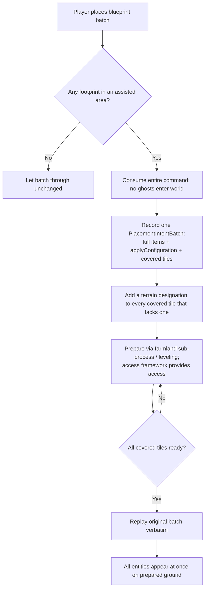

# Construction Assist

Status: in-progress architecture note.

Construction Assist is the **generic** ATD feature that lets a player place any blueprint - or any blueprintable combination of buildings - on unprepared ground and have ATD prepare the terrain first, then place the whole thing once the ground is ready. It is the deferral-and-replay layer that sits on top of the [Access Provision Framework](access-framework.md) and the [Farmland Preparation Sub-Process](farmland-preparation-subprocess.md).

This is a **design/rigor layer**. The authoritative as-built record of the implemented farm path lives in [docs/dev/done/farming-designations.md](../done/farming-designations.md) under *Farm Placement Assist*. Where this document is ahead of the code, it is called out under *Divergences from current code*.

## What it does

A blueprint may contain no farms, some farms, only farms, pipes, conveyors, storage, production buildings, or any mix. Construction Assist:

1. **Intercepts** the placement command before any ghost enters the world.
2. **Defers** the entire batch atomically - nothing in the blueprint is placed until the ground under all of it is ready.
3. **Injects** terrain designations for every footprint tile that needs work.
4. **Prepares** the terrain through the appropriate sub-process (farmland preparation for farm tiles, plain leveling for non-farm tiles), using the access framework to reach unreachable work.
5. **Replays** the original batch verbatim once every covered tile is ready.

The atomic batch is the central idea: if a blueprint contains a farm and a pipe, the pipe must not be built before the farm terrain is prepared, because a pipe ghost in the world would block the vehicles doing the terrain work.

## Two facets

Construction Assist has two terrain facets, distinguished only by **what "ready" means** for a covered tile:

| Facet | "Ready" predicate | Terrain work | Sub-process |
|---|---|---|---|
| **Farm facet** | tile is farmable (surface at target height **and** soil top layer) | prepare + fill (cut, then dump farmable soil) | [Farmland Preparation Sub-Process](farmland-preparation-subprocess.md) |
| **Leveling facet** | tile surface is flat at target height | level only (cut or fill, no soil requirement) | direct leveling designations |

A single batch can mix both: farm tiles use the farm-facet predicate, non-farm tiles use the leveling predicate, and the batch replays only when **all** covered tiles - of both kinds - are ready. The farm facet is implemented today; the leveling facet is planned.

## Glossary

**Placement intent batch**
: The unit of deferral. A record capturing the **entire** original `BatchCreateStaticEntitiesCmd` - the full `ImmutableArray<EntityConfigData>`, the `applyConfiguration` flag, and the union of covered designation tiles. No ghost exists in the world while the record is alive.

**Covered tile**
: A 4x4 designation-grid origin that overlaps the footprint of any entity in the deferred batch. Computed from each layout entity's occupied tiles (rotation and reflection aware) snapped to the 4-tile grid.

**Entity configuration** (`EntityConfigData`)
: The engine's complete serialization bag for one entity placement: prototype, transform (position + rotation + `IsReflected`), recipes, assigned/allowed products, assigned vehicles, and any typed key-value state. Everything a blueprint writes into an entity lives here. Construction Assist stores it whole so the replay reproduces the blueprint exactly.

**Ready predicate**
: The per-tile condition that must hold before the batch can replay. Farm tiles use the farmable-band predicate; non-farm tiles use the flat-at-target predicate. A batch replays only when every covered tile satisfies its own predicate.

**Replay**
: Re-issuing the captured `BatchCreateStaticEntitiesCmd` once all covered tiles are ready. A replay guard lets ATD's own re-issued command pass through the intercept instead of being captured again.

## Pipeline



### Intercept

A Harmony prefix on `EntitiesCommandsProcessor.Invoke(BatchCreateStaticEntitiesCmd)` inspects the batch. If any covered footprint falls inside an assisted tower area (and it is not an ATD replay), the **entire** original command is consumed (returns `false`, calls `cmd.SetResultSuccess()`) and a single `PlacementIntentBatch` is recorded. Batches that touch no assisted area pass through to vanilla unchanged.

The batch-level unit is deliberate: individual entity types are **not** filtered within the batch. Pipes, conveyors, and rail segments in the same blueprint are deferred alongside the terrain-needing entities so none of them build ahead of the terrain work.

### Validator suppression

Inside assisted tower areas only, the relevant placement validators are suppressed so a ghost can later be placed on prepared-but-not-yet-grown ground:

* Farm fertility (`FarmFertileGroundValidator.CanAdd`) - farm facet only.
* Terrain height / layout-terrain interaction - both facets.
* Map-bounds / ocean checks where the prepared site warrants it.

Outside assisted areas every validator passes straight through, preserving vanilla behavior.

### Prepare

Covered tiles are routed by facet:

* **Farm tiles** enter the farmland preparation session and run the full preparation -> filling pipeline; "ready" means the farmable band is complete.
* **Non-farm tiles** get a flat leveling designation at the target height; "ready" means the surface is flat at target. The leveling designator handles both cut and fill, so a tile below current terrain does not produce a "mining in the air" error.

In both cases, unreachable covered tiles are made reachable by the **access framework**, which chooses the accessway it needs (ramp, flat cut, leveling or dumping connector). Construction Assist states the work type and lets the access framework decide the shape - it does not pick a proto per facet.

### Replay

When every covered tile of a batch is ready, ATD re-issues the captured command verbatim, preserving the original `applyConfiguration` flag. Farm positions (and, for the leveling facet, all positions) in the replay are registered with the replay guard so the intercept lets ATD's own command through.

## Sequencing: farm-first

When a single tower hosts both farm work and non-farm leveling work, the leveling facet is held inactive while any farm origin on that tower is still active (non-`Done`, non-`Blocked`). Farms must finish first - including the soil fill - because farmland preparation owns the tower dump rules during filling (see [Phase Gating](farmland-preparation-subprocess.md)) and because rim/shoulder leveling from the farm pass may already flatten tiles the leveling facet would otherwise inject for.

This is the Construction Assist consequence of the access framework's rule that phases with conflicting dump rules must not overlap.

## Save / load and removability

Construction Assist keeps ATD **safe to add to and remove from saves**.

* **No mod-owned ghost state.** While a batch is deferred, no ghost exists in the world; the injected terrain designations are ordinary engine designations that survive a reload on their own.
* **Pending batches** persist only through the published **config-backed ATD state blob**, never a mod-owned save blob, so removing ATD cannot orphan serialized data. Each persisted record stores the proto, transform (including rotation and reflection), `applyConfiguration`, and farm crop/fertility settings for farm items.
* **Re-derivable.** On load, persisted batches are reconstructed and pushed back through the intercept path as if the player had re-placed them, so the deferral resumes from current terrain state.

## Diagnostic log shape

```text
[ATD Construct] tower=(x,z) intercepted batchItems=7 farmTiles=16 levelTiles=9 deferred=true
[ATD Construct] tower=(x,z) batch=#3 coveredTiles=25 ready=18 waiting=7 facet=mixed
[ATD Construct] tower=(x,z) batch=#3 sequencing=held reason=active farm work on tower
[ATD Construct] tower=(x,z) batch=#3 ready=25/25 -> replaying original command
```

## Implementation map

| File | Role |
|---|---|
| [src/ATD.FarmPlacementAssist.cs](../../../src/ATD.FarmPlacementAssist.cs) | Farm-facet intercept, deferral, replay (implemented) |

The non-farm leveling facet is not implemented; when it is, it should reuse the batch-level `PlacementIntentBatch` model rather than reintroducing per-entity deferral. See [docs/dev/done/farming-designations.md](../done/farming-designations.md) for the as-built farm-facet detail.

## Divergences from current code

These are the points where this design layer is ahead of, or differs from, the implemented farm facet.

* **Leveling facet not implemented.** Only the farm facet exists today. The non-farm leveling facet (level-only, no soil, farm-first sequencing) is the main planned work. It reuses the same intercept, batch record, footprint mapping, and access flow with a flat-at-target ready predicate.
* **Accessway shape is hardcoded in the farm facet.** The implemented path places mining-proto ramps during preparation and dumping-proto ramps during filling. The target delegates accessway shape entirely to the access framework (work type in, accessway out); the leveling facet should use that delegation from the start rather than hardcoding a leveling-proto ramp.
* **Full entity-config persistence.** During a single runtime the full `EntityConfigData` is retained and replayed verbatim. Across save/load only a compact record (proto, transform, reflection, `applyConfiguration`, farm crop/fertility) is persisted; non-farm blueprint-configured state (recipes, port configuration, assignments) is not yet restored after reload. Future work should serialize the full `EntityConfigData` bag through Mafi's `BlobWriter` / `BlobReader` with `ConfigSerializationContext`.
* **Player cancellation.** There is no UI or command to cancel a pending batch while its ghost is absent. The planned control is the tower's **Construction assistance** tab and checkbox (the renamed *Farmland preparation* tab/checkbox): disabling Construction assistance clears its internal state, dropping any pending batches and cleaning up the still-unfulfilled ATD-injected designations.
* **Placement anywhere (drop the tower-area requirement).** Today the intercept fires only when a footprint falls inside an assisted tower area. The non-farm leveling facet has no intrinsic tower dependency (leveling needs no dump-rule ownership), so its tower-area guard could eventually be dropped: tiles injected outside a tower area would surface the vanilla "designations outside the mining area" alert, which is acceptable. A hovering footprint preview (green inside / amber outside the tower area) is a planned aid for that case. The **farm facet keeps the tower-area requirement** until filling outside a tower area is solved (it would require manipulating global dump rules), so a mixed batch requires a tower area for its farm tiles but not for its non-farm tiles.

## Bug report checklist

When investigating a Construction Assist report, capture:

* Whether the batch was intercepted and deferred, or passed through to vanilla.
* The covered-tile count split by facet (farm vs leveling) and how many are ready.
* For a stuck batch: which covered tiles are not ready and why (terrain analysis state, or access not yet provided).
* Whether farm-first sequencing is holding the leveling facet inactive.
* Whether the replay fired, and whether the replayed entities kept their blueprint configuration (recipes, crops, reflection).
* For a reloaded session: whether the pending batch was restored and resumed.
