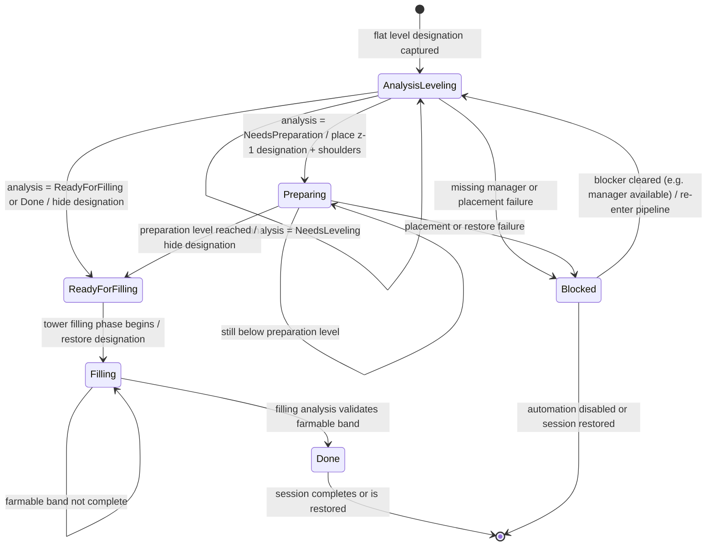

# Farmland Preparation Sub-Process

Status: in-progress architecture note.

This document gives farmland preparation the same rigorous vocabulary and state
treatment as the [Access Provision Framework](access-framework.md). It is a
**sub-process** of that framework: the access framework owns the general question
"how does a vehicle reach an origin cluster that needs work", and farmland
preparation is one concrete consumer that submits clusters into it across two
ordered major phases.

It is a **design/rigor layer**, not a replacement for the as-built reference. The
authoritative implementation record - file names, method names, exact constants,
caches, and the Harmony surface - stays in
[docs/dev/done/farming-designations.md](../done/farming-designations.md). Where
this document's conceptual model diverges from the current code, that divergence
is called out explicitly under *Divergences from current code*.

## Purpose

Farmland preparation turns a flat level designation into **farmable ground**: a
surface at the target height whose top layer is sufficiently farmable soil. It
must do this for terrain that may start above, below, or at the target, may carry
non-farmable material in the topsoil band, and may be unreachable by vehicles
until access is provided.

The sub-process should answer, diagnosably:

1. Which farmland origins still need terrain work before the surface is farmable?
2. For each origin, which **phase** of the sub-process owns it right now
   (preparation vs filling), and what is it waiting on?
3. When does the whole tower hand off from the preparation phase to the filling
   phase, and back to normal operation?
4. How does each phase request and receive vehicle access from the access
   framework?

## Scope

This applies to:

* **Terrain preparation** - levelling, cutting non-farmable material out of the
  topsoil band, and lowering surfaces that start too high.
* **Topsoil filling** - dumping farmable material back to the target height and
  validating the farmable band.
* **Phase gating and handoff** - how the two phases map onto the access
  framework's major-phase gate, and why they must not overlap.
* **Construction Assist, farm facet** - how the generic Construction Assist
  feature (deferring any blueprint placement until its footprint terrain is
  ready) interacts with farmland preparation when the blueprint contains one or
  more farms.

It does **not** cover:

* **Soil optimization** under `RequiresSoilTopLayer` (how little soil ATD could
  place while still satisfying the game's farmability threshold). This stays out
  of scope exactly as in the access framework; the requirement is preserved as an
  attribute so completion logic can be tightened later.
* Mining-only terrain work, which is a different consumer of the access
  framework.

## Relationship to the access framework

Farmland preparation does not re-implement reachability. It **submits origin
clusters** to the access framework and reacts to the `AccessClusterState` it
gets back. The mapping is:

| Access framework concept | Farmland preparation realization |
|---|---|
| Major phase (gated, non-overlapping dumping rules) | **Preparation phase** then **Filling phase** |
| Work intent | A captured flat level designation, or a deferred Construction Assist placement batch that contains one or more farms |
| Work origin | A 4x4 farmland origin tracked by a `FarmingOriginSession` |
| Work-origin attribute | `RequiresSoilTopLayer` - completion needs soil, not just height |
| Origin subcluster | Farmland is isolated into its own subcluster (prepared and filled before adjacent non-farm work) |
| Required vehicle - excavation | Preparation phase: excavator **and** hauler, assigned to the tower |
| Required vehicle - dumping | Filling phase: hauler only, global vehicles allowed |
| Phase advances when every in-scope cluster is `CompleteNoAction` | Filling begins only when **every** prep origin is `ReadyForFilling` or `Done` |

The two phases use **different tower dump rules** (preparation uses normal rules;
filling restricts the tower to farmable products only), which is exactly why the
access framework forbids phases from overlapping - see *Phase Gating* below and in
[access-framework.md](access-framework.md).

## Glossary

**Farmland origin**
: A 4x4 level designation captured into a farming session because its surface
must become farmable. The obligation-bearing unit of the sub-process. Equivalent
to the access framework's *work origin*, carrying the `RequiresSoilTopLayer`
sense implicitly (a farmland origin is never complete on height alone).

**Flat designation**
: A level designation whose four corner heights are equal within
`FARMING_HEIGHT_EPSILON = 0.05`. Only flat designations are captured; non-flat
ones are reported `SkippedNonFlat` and never enter a session. A tilted designation
is not a farmland origin.

**Target height** (`targetHeight`)
: The level designation's intended surface height. The finished farmland surface
must equal this within epsilon.

**Topsoil band**
: The 1-tile layer from `targetHeight - 1` to `targetHeight`. Farmability is
judged in this band across all 16 tiles of the 4x4 origin.

**Farmable band complete**
: Across all 16 tiles, the surface equals `targetHeight` (within
`FARMING_HEIGHT_EPSILON`) **and** the farmable thickness in the topsoil band is at
least `MIN_FARMABLE_THICKNESS = 0.9003906` (sourced from the game's
`FarmFertileGroundValidator`). This is the per-origin completion predicate.

**Preparation level**
: `targetHeight - 1`. When an origin needs preparation, ATD temporarily retargets
it one tile below the final surface so excavators clear non-farmable material and
over-height terrain out of the future topsoil band before any soil is dumped.

**Shoulder**
: A sloped dumping designation placed just outside a `Preparing` origin on any
side where the adjacent terrain edge sits below the preparation level. Each
shoulder slopes from `preparationHeight` on its inner edge to
`preparationHeight - 1` on its outer edge. The purpose of the shoulder is to prevent future topsoil from continously falling off the edge of the origin designation during filling. The shoulder designation as such is removed at the start of the filling phase.

**Rim alignment designation**
: A flat level designation at `targetHeight` placed on a boundary tile just
outside the fill area, where the terrain one step further out is within ~0.2 tiles
of `targetHeight`. It repairs terrain crests caused by the preparation and access ramps at the fill
boundary. Removed when filling completes.

N.B. Technically, the rim could be filled with non-soil, but because it helps with access to the filling area, it's integrated in the filling phase.

**Hide-until-filling**
: When an origin reaches `ReadyForFilling` (or is already farmable), its visible
level designation is removed from the terrain manager while its `DesignationData`
is retained in the session. The designation is restored at `targetHeight` when the
tower enters the filling phase, so the game's own fill-completion detection can see
it. The reason these designations must be hidden is that they otherwise cause fights during preparation. Tracked by `IsHiddenUntilFilling`.

**Farmable dump product (aliases: soil, topsoil)**
: A `LooseProductProto` whose `TerrainMaterial` is farmable
(`IsFarmable == true`) - dirt variants, compost, and any modded farmable
material, discovered dynamically. The filling phase restricts the tower's
`DumpableProducts` to this set so only farmable soil is dumped onto the band.

Note for future: If global construction assistance (i.e. outside all tower areas) including farmland preparation is ever implemented, and one or more farming origins require filling outside a tower area, the global dumping rules must be manipulated. Global construction assistance is not yet supported.

**Preparation phase** / **Filling phase**
: The two ordered major phases of the sub-process. A tower runs exactly one of the
two passes per tick (see *Pass selection*). Preparation cuts and levels; filling
dumps soil and validates. They own different tower dump rules and must not
overlap.

Note for future: Prepration by definition always includes mining work. As such, it must always be governed by a tower with a mining team assigned. Filling could technically be performed outside all tower areas. (Not yet supported)

**Pending fill area**
: The union of tiles belonging to origins queued for filling (`ReadyForFilling`
or un-activated `Done`). Used to park vehicles clear of the dump zone and to
prune work. Cached with a dirty bit.

## State model

Farmland preparation uses **two distinct enums**. They are deliberately separate:
one is a fresh read-only snapshot of terrain, the other is persisted session
progress. Do not collapse them.

### Terrain snapshot - `FarmingAnalysisState`

Recomputed from live terrain and designations on every analysis pass. Never
stored. This is the farmland equivalent of an access-framework *input property*:
an observation that feeds the phase decision, not a state in its own right.

| Value | Meaning |
|---|---|
| `Done` | Surface at target height and the topsoil band is fully farmable |
| `NeedsLeveling` | Surface at or above target; farmable band is clear; keep the level designation active |
| `ReadyForFilling` | Preparation cleared the band; topsoil fill can begin |
| `NeedsPreparation` | Non-farmable material in the future topsoil band, or surface below `targetHeight - 1` |
| `SkippedNonFlat` | Level designation has unequal corner heights; not captured |

### Per-origin phase - `FarmingOriginPhase`

Persisted in `FarmingOriginSession` across ticks. This is the farmland
sub-process's own progress state - analogous in spirit to `AccessClusterState`,
but specific to the preparation/filling pipeline rather than to reachability.

| Value | Meaning | Phase |
|---|---|---|
| `AnalysisLeveling` | Captured; analysis says `NeedsLeveling`; original level designation stays active; waiting for vanilla levelling | Preparation |
| `Preparing` | Temporary designation at `targetHeight - 1` placed; shoulders placed; waiting for excavators | Preparation |
| `ReadyForFilling` | Preparation done; level designation hidden; queued for tower filling | Preparation -> handoff |
| `Filling` | Original fill designation restored at `targetHeight`; waiting for trucks | Filling |
| `Done` | Filling pass validated the farmable band; designation hidden; origin complete | Filling |
| `Blocked` | Progress failed (missing manager, placement failure, etc.); recoverable | either |

`Done` is only reached through the **filling pass**. An origin that analysis
reports as farmable at preparation time still routes through `ReadyForFilling`
first, because adjacent preparation work can drop dirt and disturb a tile that
looked finished - filling must confirm it.

`Blocked` is **not terminal**. Like every other phase it is recomputed each tick:
an origin blocked because a required manager or dependency was missing returns to
`AnalysisLeveling` and re-enters the pipeline as soon as the blocker clears (for
example once the missing manager is available again).

### Per-origin phase diagram



## Sub-process pipeline

A tower runs one **session** (`FarmingPreparationSession`) keyed by tower
`EntityId`, ticked once per game-second on the simulation thread. Each tick runs
exactly one pass.

### Pass selection

* **Filling pass** if at least one origin is `Filling`, or the session currently
  owns the tower dump rules.
* **Preparation pass** otherwise.

This is the practical realization of *Phase Gating*: a tower cannot be cutting and
dumping-for-farmability at the same time, because the two phases hold conflicting
dump rules.

### Preparation phase

1. **Capture.** Scan the tower's level designations; add any untracked flat one as
   a new `AnalysisLeveling` origin. Rim alignment designations are skipped so they
   are never re-captured as fresh work.
2. **Advance.** For each origin, run the terrain snapshot and step the phase:
   * `AnalysisLeveling` + `NeedsLeveling` -> stay; let vanilla levelling proceed.
   * `AnalysisLeveling` + `NeedsPreparation` -> retarget to `targetHeight - 1`,
     place shoulders, move to `Preparing`.
   * `AnalysisLeveling` + `Done`/`ReadyForFilling` -> hide designation, move to
     `ReadyForFilling`.
   * `Preparing` -> re-analyze; when the surface reaches preparation level, hide
     designation and move to `ReadyForFilling`.
3. **Access.** Submit the still-unreachable preparation origins to the access
   framework as clusters that need access for **excavation work** (excavator +
   hauler, tower-assigned). The access framework decides *how* to provide that
   access: usually a mining ramp cut into the terrain, but it may equally need a
   dumping or leveling accessway to bridge a gap or climb a drop. This sub-process
   does not restrict the solution to ramps or to mining protos - it states the
   work type and the access framework figures out what to build. The vanilla
   readiness gate is `IsReadyToMineNonAmphibious()`: a cluster whose designations
   are not yet mineable (for example a fresh pad entirely above target with no
   mining bits set) is treated as inaccessible so access is generated.
4. **Gate.** The pass keeps running while any origin is `AnalysisLeveling` or
   `Preparing`, or while access is unconfirmed. When **every** origin is
   `ReadyForFilling` or `Done`, the tower hands off to filling.

### Handoff: begin filling

Triggered once the preparation gate is satisfied
(`BeginFarmingFillingForSession`):

1. Evacuate any vehicle currently inside the pending fill area outside it (kept
   assigned so they accept a park-and-wait job); wait until clear or stuck
   vehicles are detected and ignored.
2. Snapshot the dump rules of **every tower whose area overlaps the fill
   designations**, then restrict their `DumpableProducts` to farmable products
   only. Currently, ATD never touches the global `ITerrainDumpingManager` rules -
   only the overlapping towers' `MineTower.DumpableProducts`.
3. Restore every queued origin's original level designation at `targetHeight`;
   move each to `Filling` and clear `IsHiddenUntilFilling`.

### Filling phase

Each tick while filling:

1. **Clear-out.** Wait until parked vehicles have left the fill area (or ignore
   stuck ones).
2. **Cleanup.** Remove preparation shoulders and preparation ramps.
3. **Rim alignment.** Place rim alignment designations to repair the fill
   boundary, skipping tiles owned by other sessions.
4. **Access.** Submit unreachable filling origins to the access framework as
   clusters that need access for **dumping work** (hauler only; global vehicles
   allowed). As in preparation, the access framework chooses the accessway it
   needs - this sub-process does not constrain it to a particular proto or shape.
   The vanilla readiness gate is `IsReadyToDumpNonAmphibious()`.
5. **Advance.** Re-analyze each `Filling` origin; move to `Done` when the farmable
   band check passes.

### Completion

When every origin is `Done`:

1. Remove rim alignment designations immediately.
2. Run a stabilization timer so in-flight material can settle.
3. Restore the snapshotted tower dump rules;  remove
   any filling accessways.
4. Show a tower completion notification. (defer if the intent is to also place a farm blueprint)
5. Clear the session `Active` flag.

## Phase gating

The two phases must never overlap, because they hold conflicting tower dump rules
(normal during preparation; farmable-only during filling). This is the farmland
instance of the access framework's rule that *a major phase advances only when
every in-scope cluster is phase-complete on the same pass*:

* Preparation -> Filling advances only when **every** tracked origin is
  `ReadyForFilling` or `Done`. A single origin still `AnalysisLeveling` or
  `Preparing` keeps the whole tower in preparation.
* Filling -> normal (session end) advances only when **every** origin is `Done`.
* Because phases are recomputed each tick from live terrain, a regression (dirt
  falling back into a finished band, a player edit, a disturbed surface) drops the
  affected origin back to an earlier phase and the gate re-closes, exactly like
  the access framework's `CompleteNoAction` regression.

The gate is an **exact predicate over all origins**, never a rounded percentage,
matching the access framework's completion gate.

## Completion semantics

* **Per origin, boolean.** An origin is complete only when its *farmable band* is
  complete: surface at `targetHeight` **and** farmable thickness
  `>= MIN_FARMABLE_THICKNESS` across all 16 tiles. Reaching target height with a
  non-farmable top layer is **not** complete - this is the concrete meaning of the
  access framework's `RequiresSoilTopLayer` attribute.
* **Rolled up by count** for display and diagnosis, consistent with the access
  framework's completion model.

## Construction Assist (farm facet)

Construction Assist is the **generic** ATD feature that defers placement of any
blueprint - or any blueprintable combination of buildings - until its footprint
terrain has been prepared, so building ghosts never block vehicle access to the
terrain being worked. A given blueprint may contain no farms, some farms, or only
farms. This section describes the **farm facet**: what Construction Assist does
when the deferred blueprint contains one or more farms, which is the part that
drives the farmland sub-process. The non-farm leveling facet is tracked in
[docs/dev/planned/building-leveling-assist.md](../planned/building-leveling-assist.md).

1. **Intercept.** A Harmony prefix on
   `EntitiesCommandsProcessor.Invoke(BatchCreateStaticEntitiesCmd)` captures the
   **entire** original batch when any covered footprint falls inside an assisted
   tower area (and it is not an ATD replay). The original command is consumed so
   mixed blueprints stay atomic - pipes, transports, and other buildings in the
   same batch are not placed ahead of the terrain work.
2. **Footprint.** Each building's occupied tiles (rotation + reflection aware) are
   snapped to the 4x4 designation grid. Farm tiers align cleanly (T1 4x4, T2 8x8,
   T3 12x12).
3. **Suppress validation.** Inside assisted tower areas only, the farm fertility,
   terrain-height, and bounds validators are suppressed so a farm ghost can later
   be placed on prepared-but-not-yet-grown ground. Outside such areas the patches
   pass straight through.
4. **Prepare.** A flat level designation is injected for each covered tile that
   lacks one; farm tiles prepare through the normal farming session described
   above.
5. **Replay.** Once every covered tile reaches the readiness its building requires
   (`FarmingOriginPhase.Done` for farm tiles), the original batch is replayed and
   the intent is cleared.

A placement intent is registered as a `PlacementIntentBatch`. During the same
runtime the full `EntityConfigData` is retained for an exact replay; across
save/load a compact record (proto, transform, reflection, `applyConfiguration`,
and farm crop/fertility settings for farm items) is persisted in the
**config-backed ATD state blob**, with full-blob persistence listed as future
work.

## Save / load and removability

Farmland preparation keeps ATD **safe to add to and remove from saves**, matching
the workspace-wide requirement:

* **No mod-owned phase serialization.** Session phase state is not persisted as
  mod-owned save data. On save, a hook restores every temporary preparation
  designation to its original level designation, removes ramps, shoulders, and rim
  designations, and restores dump rules and truck assignments. After save the
  session re-bootstraps from the visible state.
* **Re-derivable.** The cost of this safety is that a running session must redo
  preparation analysis after each reload; nothing is lost because every phase is
  recomputed from live terrain.
* **Placement intents** persist only through the published config-backed state
  blob (not a mod-owned blob), so removing ATD cannot orphan serialized data.

## Diagnostic log shape

Farmland logs should be comparable across reports and name the phase, the origin,
and the decision. Performance lines are tagged separately.

```text
[ATD Farming] tower=(x,z) pass=preparation origins=34 leveling=6 preparing=9 readyForFilling=15 done=4 blocked=0
[ATD Farming] tower=(x,z) origin=(120,88) phase=Preparing analysis=NeedsPreparation prepLevel=5 reason=non-farmable in topsoil band
[ATD Farming] tower=(x,z) pass=preparation access=excavation unreachableClusters=2 accesswaysPlaced=2
[ATD Farming] tower=(x,z) handoff=begin-filling queuedOrigins=30
[ATD Farming] tower=(x,z) pass=filling origin=(128,92) phase=Filling analysis=NeedsFilling farmableThickness=0.41/0.90
[ATD Farming] tower=(x,z) pass=filling complete origins=34 done=34 -> restoring dump rules, removing fill accessways
```

```text
[ATD Farming Perf] tower=(x,z) preparation pass=31ms breakdown capture=4 advance=12 access=14 origins=1800
```

## Implementation map

| File | Role |
|---|---|
| [src/ATD.FarmingAnalysis.cs](../../../src/ATD.FarmingAnalysis.cs) | Read-only per-origin terrain analysis (`FarmingAnalysisState`) |
| [src/ATD.FarmingPreparationSession.cs](../../../src/ATD.FarmingPreparationSession.cs) | Session data, tick loop, phase transitions, save hook |
| [src/ATD.FarmingFillActivation.cs](../../../src/ATD.FarmingFillActivation.cs) | Filling: dump rules, clear-out, fill activation, rim alignment |
| [src/ATD.FarmingAccess.cs](../../../src/ATD.FarmingAccess.cs) | Access ramp placement for both phases, result caching |
| [src/ATD.FarmingDebugTransitions.cs](../../../src/ATD.FarmingDebugTransitions.cs) | Shoulders, transitions, `atd_farming_*` console commands |
| [src/ATD.FarmingAnalysisPanel.cs](../../../src/ATD.FarmingAnalysisPanel.cs) | Tower inspector panel |
| [src/ATD.FarmPlacementAssist.cs](../../../src/ATD.FarmPlacementAssist.cs) | Farm Placement Assist intercept and replay |

See [docs/dev/done/farming-designations.md](../done/farming-designations.md) for
exact constants, caches, and the full Harmony surface.

## Divergences from current code

These are the points where this design layer differs from, or is ahead of, the
as-built implementation. They are the integration targets between this sub-process
and the access framework.

* **Access provision is still the legacy path.** Today both phases compute their
  own reachability with a bounded BFS in `EnsureFarmingAccessForCurrentPhase`,
  group unreachable designations into disconnected clusters, and place **one ramp
  per cluster**, caching results per work-key. The access framework replaces this
  with a shared single fixpoint flood plus closest-first generation. Farmland
  preparation should eventually call *into* the `Access/` library rather than
  re-implementing reachability - the `ATD.FarmingAccess.cs` helpers are the code
  this sub-process will hand off.
* **Subcluster isolation is implicit.** The access framework models farmland as
  an explicit subcluster that must be prepared and filled before adjacent non-farm
  work. Current code achieves separation through per-session ownership and tile
  reservation rather than a first-class subcluster type.
* **Accessway shape is hardcoded per phase.** The current code always picks
  mining-proto ramps in preparation and dumping-proto ramps in filling. This
  design layer instead states only the **work type** (excavation vs dumping) and
  lets the access framework choose the accessway it needs - a ramp, flat cut, or
  leveling/dumping connector - so a preparation cluster that actually needs a
  small fill to be reachable is no longer forced into a mining ramp. The
  phase-to-vehicle mapping (excavation needs excavator + hauler tower-assigned;
  dumping needs only a hauler) stays the same; only the rigid proto/shape choice
  moves into the shared library on integration.
* **Soil optimization deferred.** `RequiresSoilTopLayer` is satisfied by filling
  to a full farmable band; the reduced-soil optimization remains out of scope in
  both documents.

## Bug report checklist

When investigating a farmland report, capture:

* Tower location and whether the session is enabled/active.
* Current pass (preparation or filling) and whether dump rules are owned.
* Per-origin `FarmingOriginPhase` counts, and any `Blocked` origins with reason.
* For a stuck preparation: the analysis result (`NeedsPreparation` vs
  `NeedsLeveling`) and whether excavation access was confirmed or an accessway was
  generated.
* For a stuck filling: the farmable thickness vs `MIN_FARMABLE_THICKNESS`, whether
  dumping access was confirmed, and whether the dump rules were switched to
  farmable-only.
* Whether the handoff gate is blocked by a single lagging origin.
* For Construction Assist (farm facet): whether an intent is pending, which
  covered tiles are not yet `Done`, and whether the replay fired.
